# QUANTUM-POWERED PLANNER FOR EV CHARGING NETWORKS
## Greening the road ahead: Charging demand location model for sustainable electric vehicle adoption.
Quantum computers based on neutral atoms have introduced novel approaches to solving complex problems in combinatorial optimization. While many applications focus on encoding problems as maximal independent set (MIS) formulations, these devices can handle even more challenging tasks by utilizing the Rydberg blockade mechanism, allowing us to address non-linearities in problem formulations.

This quantum methodology aligns perfectly with our objective of optimizing the electric vehicle (EV) charging network (EVCN) within urban environments. These settings present complex challenges, where multiple factors, including population density, traffic patterns, existing infrastructure, and EV adoption rates, introduce non-linear complexities into the equation.

Our solution builds upon this foundation, by harnessing Pasqal's quantum computing technology, our approach seeks to efficiently resolve the complexities of charging station placement in urban settings, leveraging the power of quantum annealing techniques in neutral atoms architectures to determine the optimal solution effectively. 

We have shown the results of the EVCN problem for the quantum adiabatic algorithm (QAA) and the quantum approximate optimization algorithm (QAOA) for instances up to 13 qubits. We present results for 5 random instances of each problem size. The results are encouraging as the probability of finding the 5 best solutions to each problem is above a quadratic speedup without deep finetuning.

This platform is highly adaptable and can be tailored to any complex local context where users provide input data. In doing so, it contributes significantly to the transition toward a net-zero emission transport economy, addressing sustainable urban mobility challenges on a broader scale.

## EVCN Model

Our proposed solution starts from the well-known maximal independent set (MIS) problem, with the cost function

$$Cost(x) = -\sum_i x_i + 2\sum_{(i,j) \in E}x_i x_j$$ 

where $x_i$ represent all the possible charging station locations. If $x_i$ = 1, a charging station is present at the location $x_i$. The second term in the cost function represents the penalization of two neighboring locations both being occupied simultaneously. The solution to this problem will represent a maximal set of EV charging stations that are not close to each other, therefore maximizing the coverage of the network.

The MIS is an oversimplification of the EVCN model and different factors such as population density, traffic patterns, existing infrastructure, and EV adoption rates must be taken into account. For example, these factors can make two neighboring locations being better suited than just one of them. Therefore, we propose a new formulation given by  

$$Cost(x) = x^TQx = -\sum_i x_i + \sum_{(i,j)\in E}\lambda_{i,j} x_i x_j$$ 

where $\lambda_{ij}$ not only represents a penalization of the connected locations but additionally it represents other factors, including population density, traffic patterns, existing infrastructure, and EV adoption rates. They also represent the off-diagonal values of the quadratic unconstrained binary optimization (QUBO) matrix $Q$, which can be solved on a neutral atom device.

We assume a linear relation between the demand on two neighboring locations and the penalizations $\lambda_{ij}$. The cutoff charging demand values in the following text are selected as such for illustration purposes. We will scale them appropriately in a real-world implementation. In this example, we work with a demand $\delta_{i}$ arbitrary units for every location. If the sum of demands on two neighboring locations, $\delta_{T_{ij}}$, is less than $\delta_{min}$, the penalization is $\lambda_{max}$ (equal to the MIS). If the demand is between $\delta_{min}$ and $\delta_{max}$, the penalization will change proportionally to the demand, and if it is above $\delta_{max}$, a minimum penalization is used, i.e., $\lambda_{min}$.

$$
\lambda_{i,j}(\delta_T) =
\begin{cases}
  \lambda_{max} & \text{if } \delta_{T_{ij}} < \delta_{min} \\
  m \delta_{T_{ij}} + b & \text{if } \delta_{min} \le \delta_{T_{ij}} \le \delta_{max} \\
  \lambda_{min} & \text{if } \delta_{T_{ij}} > \delta_{max}  \\
\end{cases}
$$

where $\delta_{i(j)}$ represents the demand at location $i(j)$, and $\delta_{T_{ij}} = \delta_i + \delta_j$ the sum of local demnads at postions $i$ and $j$. 

$$m = \frac{\lambda_{min} - \lambda_{max}}{\delta_{max} - \delta_{min}}$$

$$b = \lambda_{min} - m \delta_{max}$$

 

 

## Example: EVCN for 8 locations in a 3 x 3 grid
### Visualization of the problem
In the figure below, we show the problem we use in our example. The background on the left figure shows the demand at each location, with a darker red representing higher demand, the vertices representing the EV locations, and the edges representing the locations that are close to each other. The figure on the right shows the same problem but in this case, the color of the edges represents the $\lambda_{ij}$ strength with a red color representing a high penalization and a dark blue a small one. For example, $\lambda_{0,1} = 0.3$ is a small penalization because in locations 0 and 1 there is a high demand, and $\lambda_{3,7}=1.83$ is a large penalization because in locations 3 and 7 there is a small demand.

 

 

### Docplex model

Docplex is the Python interface of the IBM's CPLEX solver, a widely used solver for combinatorial optimization problems. This solver is highly efficient in solving linear programming and quadratic programming problems using state of the art optimization techniques. We will use this classical optimizer to find the optimal solution for our examples, as well as, to show the scalability properties of our task on classical solvers.

 

 

### Visualization of the solution

The Figure below shows the optimal solution for our example. The red dots represent the locations used as charging stations. Note that in this case, two neighboring locations can be selected at the same time, this is the outcome of considering that multiple factors affect the model, and not only the distance between possible charging station locations.

 

 

### Classical solution using brute force

Below, we show the brute force solution of the model consists of trying all the possible solutions. As this method grows as $2^n$ for $n$ charging station locations, it becomes prohibitively even for small problem sizes.

 

 

### Finding the neutral atoms' positions

Once we have set the problem of the EVCN. The next step is to find the position of the atoms that represent the problem. To this end, we start with the position of the atoms based on the graph above as the initial guessing and use the $Powell$ optimization method to find the best coordinates that represent the matrix $Q$. 

 

 

# Solving the problem using Quantum Algorithms

We use two different optimizer to find solutions to the problem, the quantum adiabatic algorithm (QAA) and the quantum approximate optimization algorithm (QAOA). To test the capabilities of the methods to find good solutions we use two methods, calculate the success probability to find the optimal solution $p(^* x)$ and the approximation ratio $r$ to get the average cost of the probability distribution. The approximation ratio is given by

$$r = \frac{\langle H_C \rangle - \langle H_{max} \rangle}{\langle H_{min} \rangle - \langle H_{max} \rangle},$$

where $\langle H_C \rangle$ is the cost of the samples evaluated, $\langle H_{min} \rangle$ is the minimum energy, and $\langle H_{max} \rangle$ is the maximum energy. A value of $r=1$ means a 100\% probability of getting the optimal solution.

## QAOA Solution

In our QAOA solution for the EVCN problem, we introduce a novel technique known as 'transfer learning.' This approach uses preoptimized parameters obtained from a distinct problem. In our case, the parameters we use come from a completely different problem called the Bin Packing Problem (BPP), and they were obtained in the gate-based QAOA for p=10, (we will show this technique more in deep in a paper coming soon). To the best of our knowledge, this is the first time that a technique like this has been applied to neutral atoms' protocols. This technique significantly reduces the need for classical optimization when solving a given problem.

Additianlly, we encode the $\gamma$ and $\beta$ parameters in the amplitude of $\delta$ and $\Omega$, respectively. Previous efforts, encode the $\gamma$ and $\beta$ parameters in the duration of the pulses keeping $\Omega$ and $\delta$ amplitude constant. However, it representes a longer schedule time, we jump from a time of $100\mu s$ with the previous encoding to $1\mu s$ with the proposed modification, and we get comparable results in terms of the quality using both methods. 

 

 

### Visualization of the final state probability distribution

After applying the sequence of QAOA, we can visualize the probability distribution of the solutions. As we see below, two out of the three lowest energy solutions are the most probable to get this indicates that our method has success in finding good solutions.

 
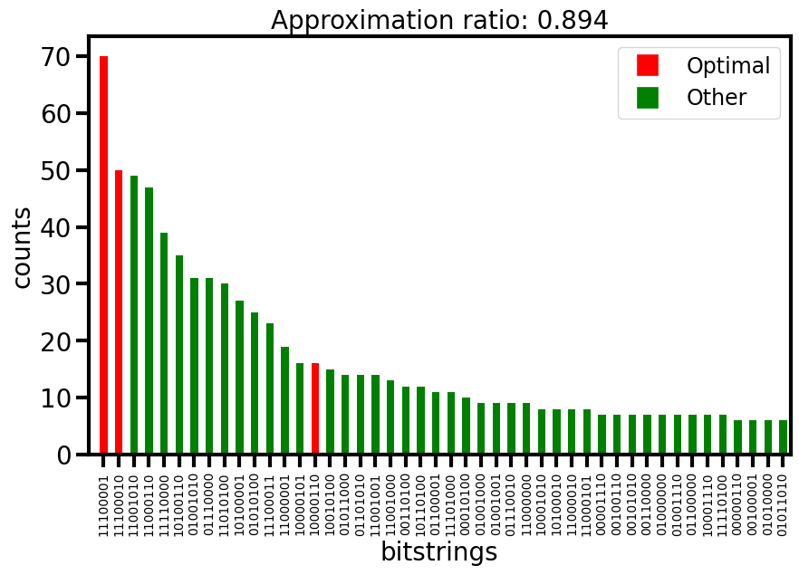
 

#### Cost function for p layers
The Figure below shows the average cost of sampling 1000 times the final probability distribution for different number of layers $p$ of the QAOA algorithm.
 
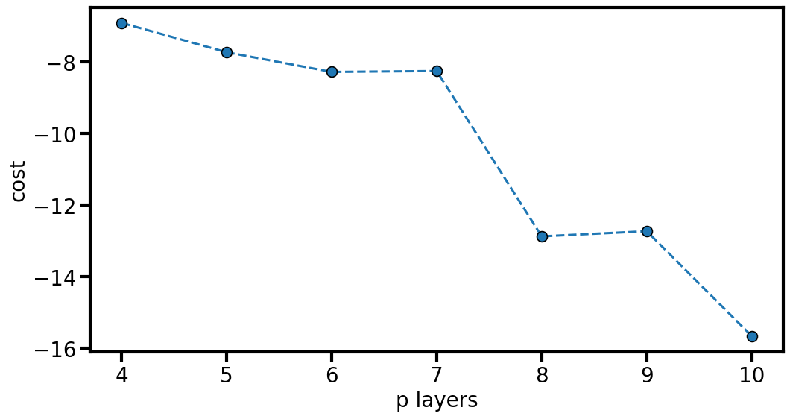
 

#### Approximation ratio of QAOA
 
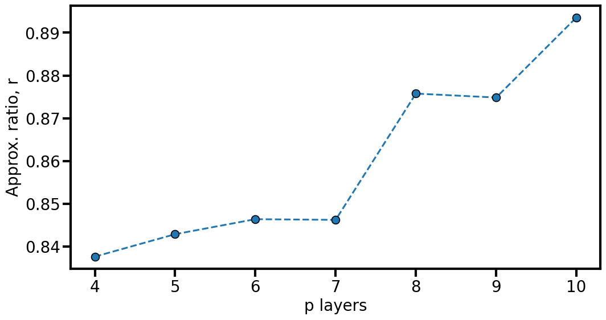
 

## QAA Solution

In the solution of our quantum adiabatic algorithm (QAA), we use the predefined adiabatic pulse and the register we have defined before. In this case, we leave the system to evolve during 4$\mu s$. In this algorithm, we leave the system to evolve slowly enough to remain in states close to the ground state, therefore increasing the probability of getting states with low energy.

 
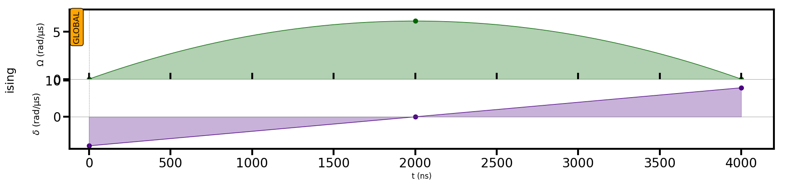
 

### QAA solution visualization for T = 4000 ns

Below, it is shown the solution got using the QAA algorithm for the EVCN with 8 locations. The solution show a large probability of getting the optimal solution and an approximation ratio of 0.97.
 
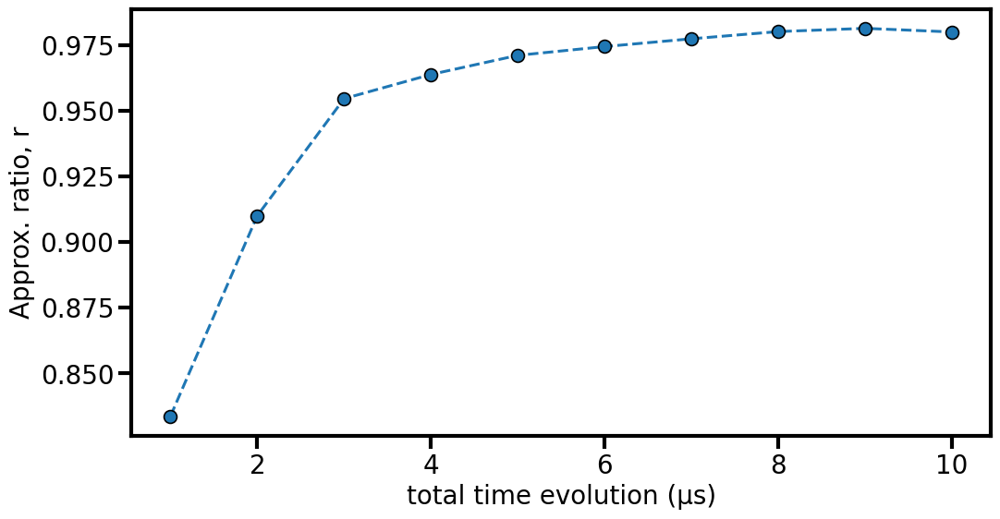
 

#### Cost of QAA

The figure below shows the evolution of the average energy of the EVCN for times ranging from 0.4$\mu$s to 10$\mu$s.
 
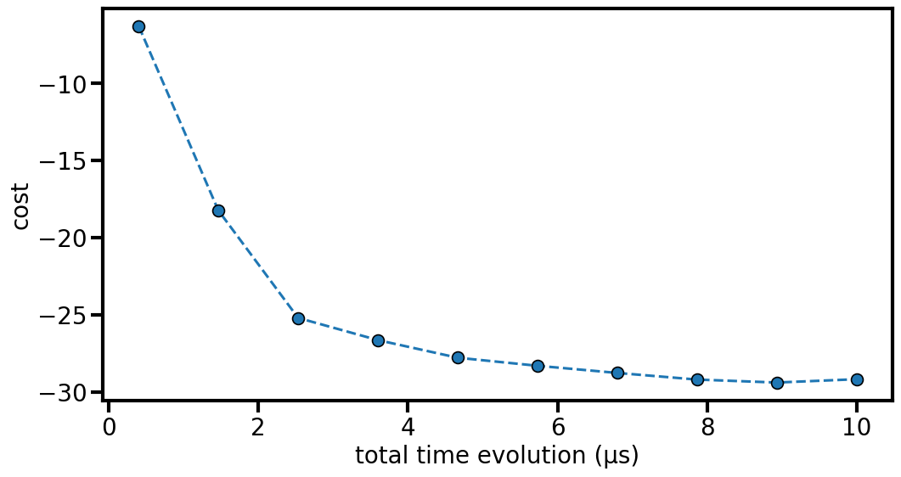
 

#### Approximation ratio of QAA
 

 

## Comparison QAOA and QAA for the same evolution time

<body>
    

        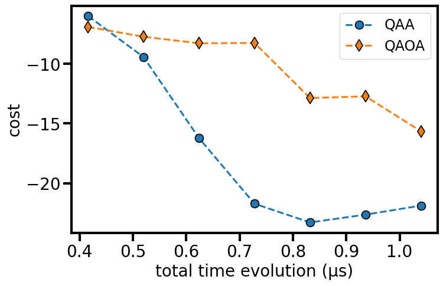
        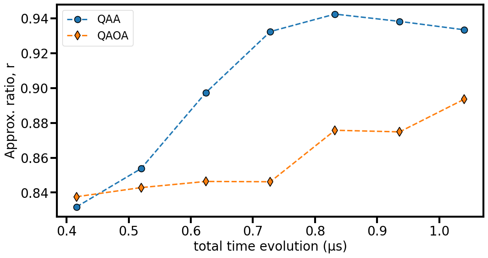
    

</body>

# Scale of the EVCN

In this section, the scale properties of the EVCN are shown for the quantum and the classical solvers. For the quantum solver, we use the QAOA and QAA algorithms for problem sizes ranging from 5 to 13 qubits. 10 random cases are selected for each problem size. We show two quantifiers of the quantum algorithms, the probability of finding the 5 best solutions using each quantum solver $p(^*x)$, and the approximation ratio $r$. 

## QAOA Solution

For the QAOA solution, we use the transfer learning methodology we presented in previous sections. Therefore, p=10 layers are used with preoptimized values of a BPP obtained in gate based models are transfered to all the random cases we present here. This p=10 only requires $t=1 \mu s$.

## QAA Solution

For the QAA solution, we use two different annealing times $4\mu s$ and $10 \mu s$ to see if there are differences in the mean cost and optimal sampling rate between both times. We use the same annealing procedure presented above.

## Plot quantum algorithms scaling solutions 

For the plots shown below, the error bars represent the **quartiles** Q1 to Q2 and Q2 to Q3 and the marker is the **median** value over the 10 random cases. The information we can get at this scale is still too short to conclude about the scaling in the neutral atoms platform. But, the data shows good characteristics that we want to highlight:

    1) Both methods QAOA and QAA show good characteristics to identify the optimal solution. This can be seen in the figure below, where the probability of finding the 5 best solutions remains higher than a quadratic speedup (The advantage of Grover's algorithm in dashed line).

    2) There is an improvement in the approximation ratio for QAA changing T from 4 us to 10 us, but the difference is not too big. We need larger cases to see how they start to deviate. For both cases of QAA the approximation ration keeps above 0.9 while in QAOA it keeps above 0.8 without optimization.

## Probability of finding the first 5 optimal solutions $p(^*x)$for QAOA and QAA
 
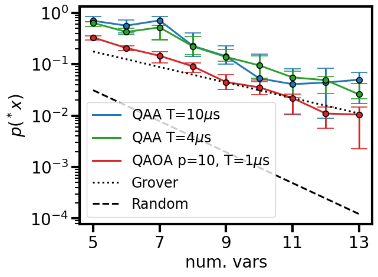
 

## Approximation ratio $r$ for QAOA and QAA
 
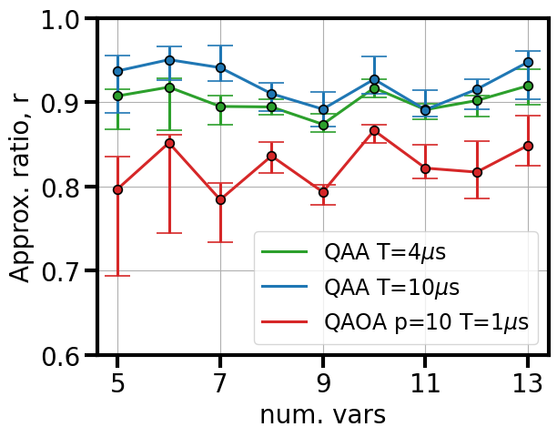
 

## Docplex solution

Finally, we did simulation of the EVCN model using classical computation. To this end, we select CPLEX because of being widely use in combinatorial optimization for business purposes. The EVCN problem is harder to solve than the MIS, and already with 1000 variables (the limit of CPLEX free version allows) the time to solution grows up to 30 seconds. If we take this solutions as an indication of the scaling time of the EVCN it will take around 3.6 hours for a 2000 variables solution and 54.4 years for 4000 variables on a MacBook Pro M1 with 8 cores. 

### Comparison time to solution EVCN vs. MIS
 
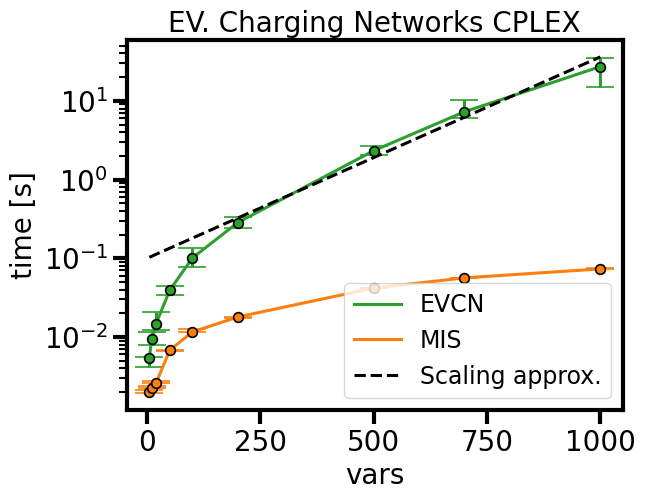
 

### Estimation of the time to solution using CPLEX for larger problem size
This estimation is made based on the results of CPLEX scaling up to 1000 variables, i.e., the previous plot.
 
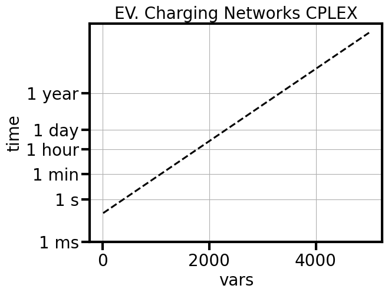
 

# Conclusions

We have presented the EVCN problem, a combinatorial optimization problem for the electric vehicle charging network election. It searches for the optimal allocation of charging stations that satisfies different characteristics in the election of locations such as population density, traffic patterns, existing infrastructure, and EV adoption rates. The model has been shown to be hard to solve using a classical optimizer compared to the MIS version of the same problem which only considers the distance between charging station locations. Additionally, this problem is perfectly tailored to the neutral atoms device of Pasqal, where atoms represent possible charging station locations, and the proximity of the represents the distance between charging station locations and the other factors mentioned previously.

The solutions to the problem using quantum algorithms have been shown to give approximation ratios above 0.9 for the QAA algorithm for up to 13 qubits using an annealing time of $4 \mu s$, and an approximation ratio of 0.8 for QAOA with p=10 (time = $1\mu s$). In terms of the probability of finding optimal solutions, the QAA algorithm keeps above the quadratic speedup and the QAOA with the transfer learning technique in the same range of quadratic speedup. These two characteristics make us optimistic about this application, and we are ahead to test it on real hardware and a large number of qubits to have a stronger point about the scalability of the quantum algorithms.

# Future Work 

We anticipate that with generation 2 of the Pasqal machine, we will be able to encode larger problem sizes and with higher precision in the representation of the QUBO matrix $Q$ of the EVCN. The 3D layout of that generation will mean a jump in precision.

However, for this problem to be meaningful at the production scale more atoms will be needed to surpass the classical solution limit. We envision being able to present solutions for EVCN with a grid size of 1000 x 1000, to this end, we will use a hybrid algorithm that solves small sections of the 1000 x 1000 grids using quantum computation and present them as the starting point of a classical heuristic algorithm such as simulate annealing to find good enough solutions of the problem. 

We have seen that the classical algorithm already with 4000 variables requires 54 years to find the solution (this cannot be taken as a near-accurate estimation but helps in our statement). Let's think that it will take around 5 days on an HPC system to give a good enough solution for the 4000 variables, so to find the solution of a 100 x 100 grid (needed for a medium size city) we will need (100 x 100) / 4000 ~ 3 runs, this means 3 x 5 = 15 days time to find the initial guess for the heuristic algorithm. On the other hand, a neutral atom device with the 4000 variables and with a sampling ratio of 10 solutions per second will give us an initial guess solution of 3 x (1/10) ~ 0.3 seconds (we haven't done assumptions of the annealing time but as it is in the order of $\mu s$ we don't see a large overhead because of this parameter).

## Example of a grid size of 100 x 100 in the city of Dallas

 
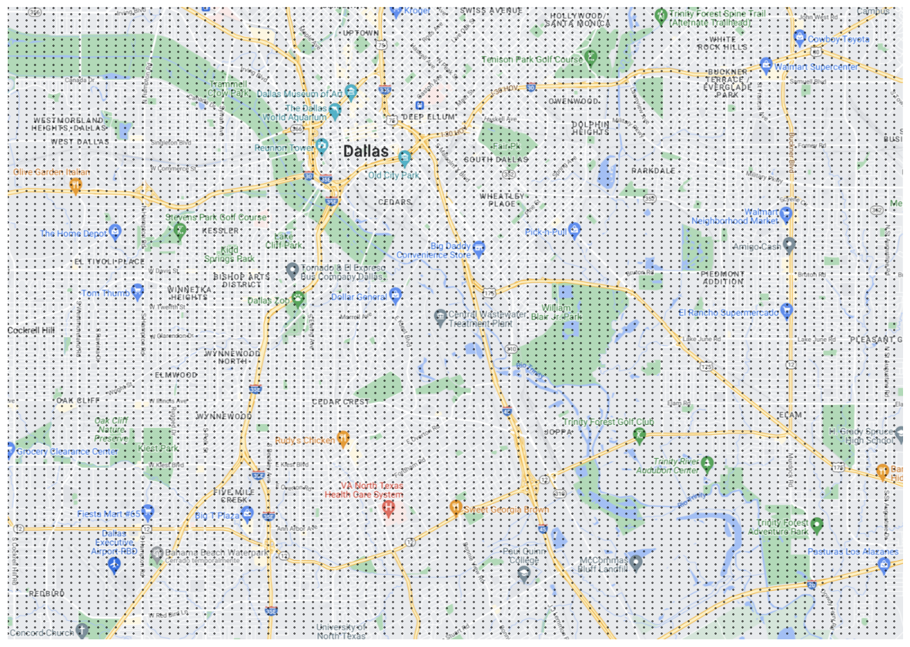
 
