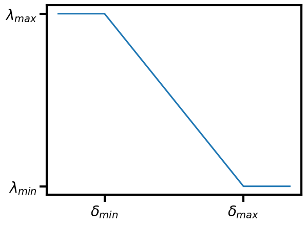
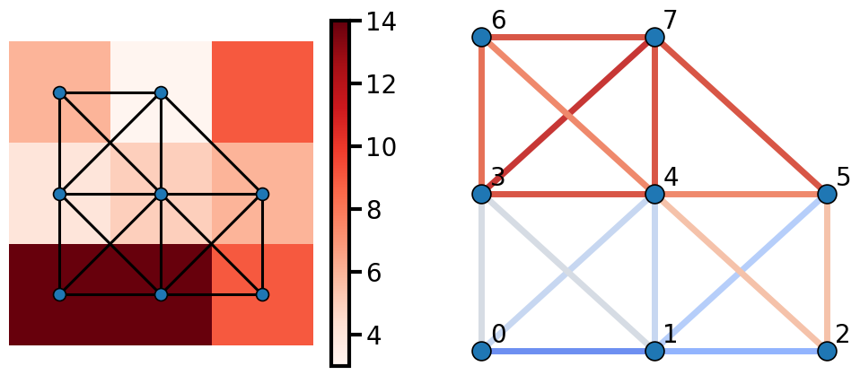
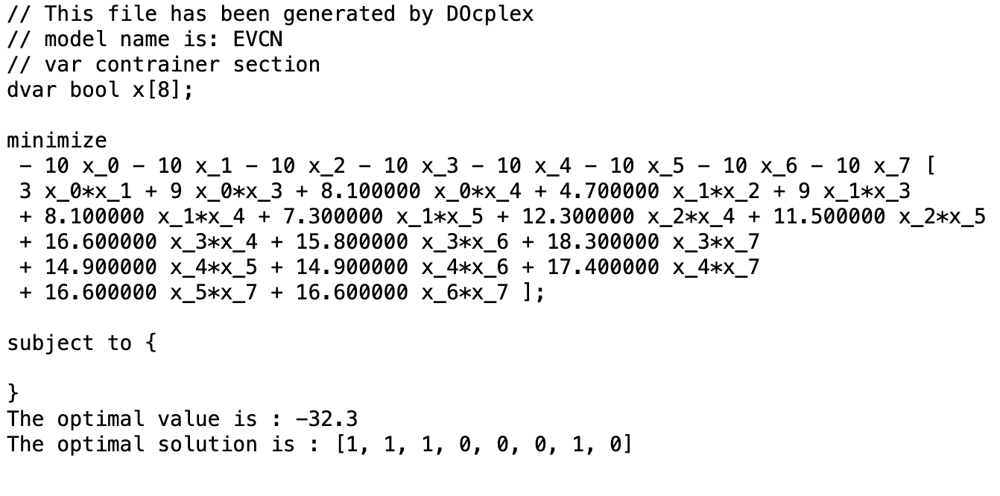
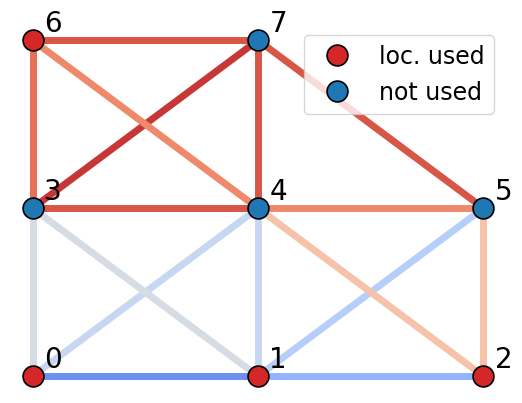
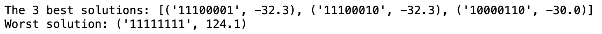
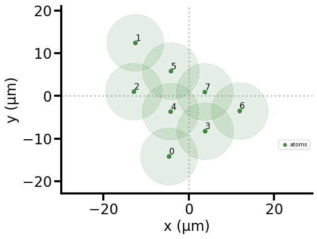
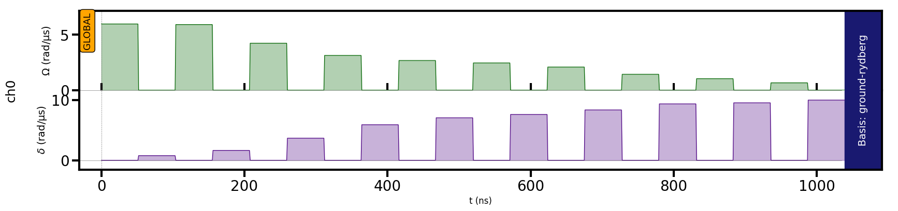

# QUANTUM-POWERED PLANNER FOR EV CHARGING NETWORKS
## Greening the road ahead: Charging demand location model for sustainable electric vehicle adoption.
Quantum computers based on neutral atoms have introduced novel approaches to solving complex problems in combinatorial optimization. While many applications focus on encoding problems as maximal independent set (MIS) formulations, these devices can handle even more challenging tasks by utilizing the Rydberg blockade mechanism, allowing us to address non-linearities in problem formulations.

This quantum methodology aligns perfectly with our objective of optimizing the electric vehicle (EV) charging network (EVCN) within urban environments. These settings present complex challenges, where multiple factors, including population density, traffic patterns, existing infrastructure, and EV adoption rates, introduce non-linear complexities into the equation.

Our solution builds upon this foundation, by harnessing Pasqal's quantum computing technology, our approach seeks to efficiently resolve the complexities of charging station placement in urban settings, leveraging the power of quantum annealing techniques in neutral atoms architectures to determine the optimal solution effectively. 

We have shown the results of the EVCN problem for the quantum adiabatic algorithm (QAA) and the quantum approximate optimization algorithm (QAOA) for instances up to 13 qubits. We present results for 5 random instances of each problem size. The results are encouraging as the probability of finding the 5 best solutions to each problem is above a quadratic speedup without deep finetuning.

This platform is highly adaptable and can be tailored to any complex local context where users provide input data. In doing so, it contributes significantly to the transition toward a net-zero emission transport economy, addressing sustainable urban mobility challenges on a broader scale.

## EVCN Model

Our proposed solution starts from the well-known maximal independent set (MIS) problem, with the cost function

$$Cost(x) = -\sum_i x_i + 2\sum_{(i,j) \in E}x_i x_j$$ 

where $x_i$ represent all the possible charging station locations. If $x_i$ = 1, a charging station is present at the location $x_i$. The second term in the cost function represents the penalization of two neighboring locations both being occupied simultaneously. The solution to this problem will represent a maximal set of EV charging stations that are not close to each other, therefore maximizing the coverage of the network.

The MIS is an oversimplification of the EVCN model and different factors such as population density, traffic patterns, existing infrastructure, and EV adoption rates must be taken into account. For example, these factors can make two neighboring locations being better suited than just one of them. Therefore, we propose a new formulation given by  

$$Cost(x) = x^TQx = -\sum_i x_i + \sum_{(i,j)\in E}\lambda_{i,j} x_i x_j$$ 

where $\lambda_{ij}$ not only represents a penalization of the connected locations but additionally it represents other factors, including population density, traffic patterns, existing infrastructure, and EV adoption rates. They also represent the off-diagonal values of the quadratic unconstrained binary optimization (QUBO) matrix $Q$, which can be solved on a neutral atom device.

We assume a linear relation between the demand on two neighboring locations and the penalizations $\lambda_{ij}$. The cutoff charging demand values in the following text are selected as such for illustration purposes. We will scale them appropriately in a real-world implementation. In this example, we work with a demand $\delta_{i}$ arbitrary units for every location. If the sum of demands on two neighboring locations, $\delta_{T_{ij}}$, is less than $\delta_{min}$, the penalization is $\lambda_{max}$ (equal to the MIS). If the demand is between $\delta_{min}$ and $\delta_{max}$, the penalization will change proportionally to the demand, and if it is above $\delta_{max}$, a minimum penalization is used, i.e., $\lambda_{min}$.

$$
\lambda_{i,j}(\delta_T) =
\begin{cases}
  \lambda_{max} & \text{if } \delta_{T_{ij}} < \delta_{min} \\
  m \delta_{T_{ij}} + b & \text{if } \delta_{min} \le \delta_{T_{ij}} \le \delta_{max} \\
  \lambda_{min} & \text{if } \delta_{T_{ij}} > \delta_{max}  \\
\end{cases}
$$

where $\delta_{i(j)}$ represents the demand at location $i(j)$, and $\delta_{T_{ij}} = \delta_i + \delta_j$ the sum of local demnads at postions $i$ and $j$. 

$$m = \frac{\lambda_{min} - \lambda_{max}}{\delta_{max} - \delta_{min}}$$

$$b = \lambda_{min} - m \delta_{max}$$

 

 

## Example: EVCN for 8 locations in a 3 x 3 grid
### Visualization of the problem
In the figure below, we show the problem we use in our example. The background on the left figure shows the demand at each location, with a darker red representing higher demand, the vertices representing the EV locations, and the edges representing the locations that are close to each other. The figure on the right shows the same problem but in this case, the color of the edges represents the $\lambda_{ij}$ strength with a red color representing a high penalization and a dark blue a small one. For example, $\lambda_{0,1} = 0.3$ is a small penalization because in locations 0 and 1 there is a high demand, and $\lambda_{3,7}=1.83$ is a large penalization because in locations 3 and 7 there is a small demand.

 

 

### Docplex model

Docplex is the Python interface of the IBM's CPLEX solver, a widely used solver for combinatorial optimization problems. This solver is highly efficient in solving linear programming and quadratic programming problems using state of the art optimization techniques. We will use this classical optimizer to find the optimal solution for our examples, as well as, to show the scalability properties of our task on classical solvers.

 

 

### Visualization of the solution

The Figure below shows the optimal solution for our example. The red dots represent the locations used as charging stations. Note that in this case, two neighboring locations can be selected at the same time, this is the outcome of considering that multiple factors affect the model, and not only the distance between possible charging station locations.

 

 

### Classical solution using brute force

Below, we show the brute force solution of the model consists of trying all the possible solutions. As this method grows as $2^n$ for $n$ charging station locations, it becomes prohibitively even for small problem sizes.

 

 

### Finding the neutral atoms' positions

Once we have set the problem of the EVCN. The next step is to find the position of the atoms that represent the problem. To this end, we start with the position of the atoms based on the graph above as the initial guessing and use the $Powell$ optimization method to find the best coordinates that represent the matrix $Q$. 

 

 

# Solving the problem using Quantum Algorithms

We use two different optimizer to find solutions to the problem, the quantum adiabatic algorithm (QAA) and the quantum approximate optimization algorithm (QAOA). To test the capabilities of the methods to find good solutions we use two methods, calculate the success probability to find the optimal solution $p(^* x)$ and the approximation ratio $r$ to get the average cost of the probability distribution. The approximation ratio is given by

$$r = \frac{\langle H_C \rangle - \langle H_{max} \rangle}{\langle H_{min} \rangle - \langle H_{max} \rangle},$$

where $\langle H_C \rangle$ is the cost of the samples evaluated, $\langle H_{min} \rangle$ is the minimum energy, and $\langle H_{max} \rangle$ is the maximum energy. A value of $r=1$ means a 100\% probability of getting the optimal solution.

## QAOA Solution

In our QAOA solution for the EVCN problem, we introduce a novel technique known as 'transfer learning.' This approach uses preoptimized parameters obtained from a distinct problem. In our case, the parameters we use come from a completely different problem called the Bin Packing Problem (BPP), and they were obtained in the gate-based QAOA for p=10, (we will show this technique more in deep in a paper coming soon). To the best of our knowledge, this is the first time that a technique like this has been applied to neutral atoms' protocols. This technique significantly reduces the need for classical optimization when solving a given problem.

Additianlly, we encode the $\gamma$ and $\beta$ parameters in the amplitude of $\delta$ and $\Omega$, respectively. Previous efforts, encode the $\gamma$ and $\beta$ parameters in the duration of the pulses keeping $\Omega$ and $\delta$ amplitude constant. However, it representes a longer schedule time, we jump from a time of $100\mu s$ with the previous encoding to $1\mu s$ with the proposed modification, and we get comparable results in terms of the quality using both methods. 

 

 

